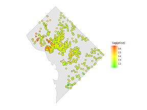

# A Bayesian approach to valuing walkable neighborhoods in Washington DC

This repository contains data, code, and the paper associated with my final project for the ST451 Bayesian Machine Learning course at the London School of Economics, which I completed during Lent term 2023.

- `paper/` - This directory contains the full paper detailing the project's research, methodology, results, and implications.
- `data/` - This directory contains the original data files used in this project, primarily derived from Zillow and covering residential properties in Washington, D.C.
- `code/` - This directory contains all the scripts and notebooks used to conduct the analysis and generate the results discussed in the paper.
- `figures/` - This directory contains all the generated figures and visualizations used in the paper.

## Findings

- The paper explores the relationship between proximity to specific categories of amenities and residential property listing prices.
- Of the three different engineered measures of proximity to amenities, distance in meters to the nearest instance of an amenity category is found to be the most predictive of property price.
- I show that the relationship between proximity to amenities and property price is non-linear and varies across neighborhoods.
- I show the importance of considering both spatial and non-linear relationships when analyzing the impact of walkability-related factors on property values.
- Transportation infrastructure, represented as distance to the nearest metro station, appears to have a meaningful relationship with property prices, hinting at its importance when designing walkable cities.

## License

 

## Feedback

For any questions or suggestions, please feel free to open an issue here or contact me at the email address listed on my profile.